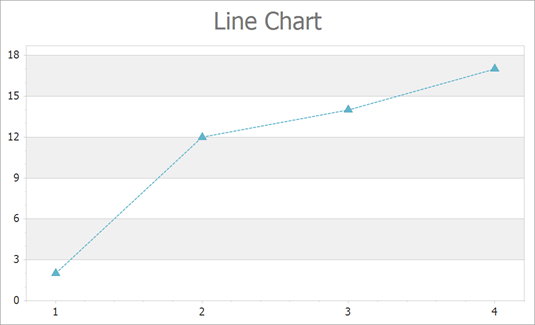

<!-- default badges list -->

<!-- default badges end -->

# Chart for WinForms - Create a Line Chart

This example shows how to create a [Line](https://docs.devexpress.com/WindowsForms/2976/controls-and-libraries/chart-control/series-views/2d-series-views/point-and-line-series-views/line-chart?p=netframework) chart at runtime.

In this example, you add a [`Series`](https://docs.devexpress.com/CoreLibraries/DevExpress.XtraCharts.Series) object to the [`ChartControl.Series`](https://docs.devexpress.com/WindowsForms/DevExpress.XtraCharts.ChartControl.Series) collection and then populate its [`Series.Points`](https://docs.devexpress.com/CoreLibraries/DevExpress.XtraCharts.Series.Points) collection with points.

The Chart Control uses the [XY-Diagram](https://docs.devexpress.com/WindowsForms/5908/controls-and-libraries/chart-control/diagram/xy-diagram?p=netframework) to display the line series. Cast the [`ChartControl.Diagram`](https://docs.devexpress.com/WindowsForms/DevExpress.XtraCharts.ChartControl.Diagram?p=netframework) property to the [`XYDiagram`](https://docs.devexpress.com/CoreLibraries/DevExpress.XtraCharts.XYDiagram?p=netframework) type to access diagram settings. The Chart Control determines the diagram type based on the series that is added first. We recommend that you access the diagram to configure its settings after at least one series is added to the chart. 

Note that you can cast the [`View`](https://docs.devexpress.com/CoreLibraries/DevExpress.XtraCharts.SeriesBase.View?p=netframework) property of the series to the [`LineSeriesView`](https://docs.devexpress.com/CoreLibraries/DevExpress.XtraCharts.LineSeriesView) type to access line series appearance settings.

## Files to Look At

* [Form1.cs](./CS/Series_LineChart/Form1.cs) (VB: [Form1.vb](./VB/Series_LineChart/Form1.vb))

## Documentation

* [Line Chart](https://docs.devexpress.com/WindowsForms/2976/controls-and-libraries/chart-control/series-views/2d-series-views/point-and-line-series-views/line-chart?p=netframework)
* [Series](https://docs.devexpress.com/WindowsForms/6167/controls-and-libraries/chart-control/series)

## More Examples

* [How to create a Spline chart](https://github.com/DevExpress-Examples/how-to-create-a-spline-chart-e1048)
* [How to create a 3D Line chart](https://github.com/DevExpress-Examples/how-to-create-a-3d-line-chart-e1026)
* [How to Plot an XY Series with a Histogram in the WinForms Chart](https://github.com/DevExpress-Examples/winforms-charts-plot-xy-series-with-histogram)
* [How to Implement the Best Fit Function, and Apply it to a Chart's Series](https://github.com/DevExpress-Examples/winforms-charts-apply-the-best-fit-function-to-a-series)
